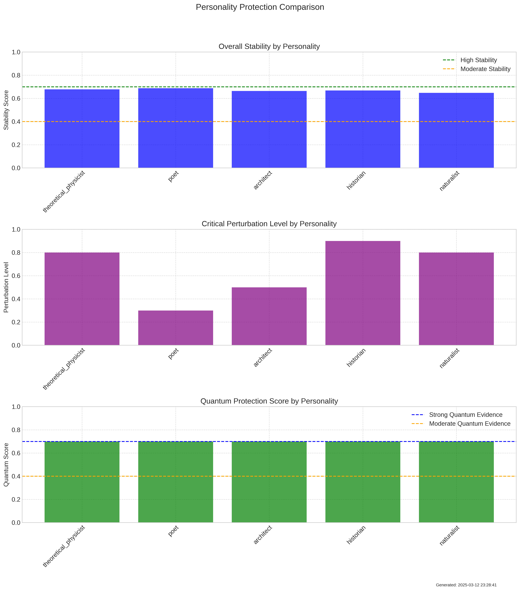
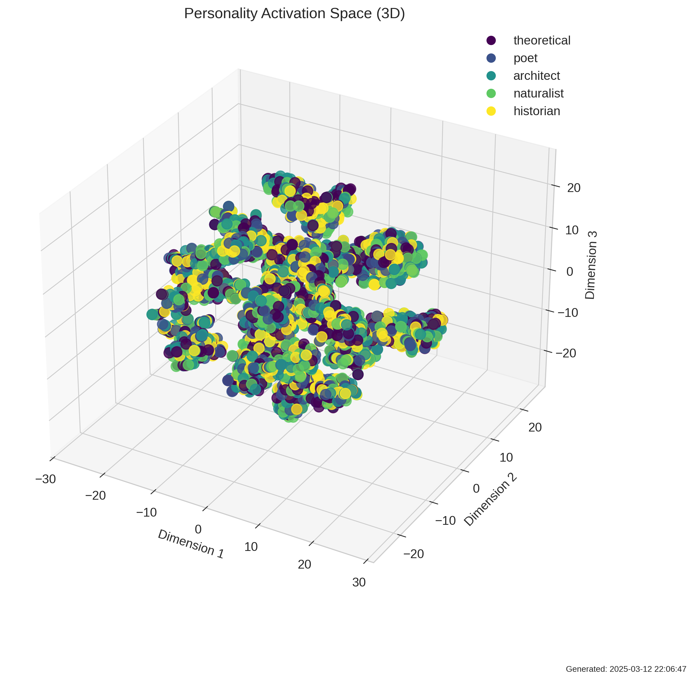
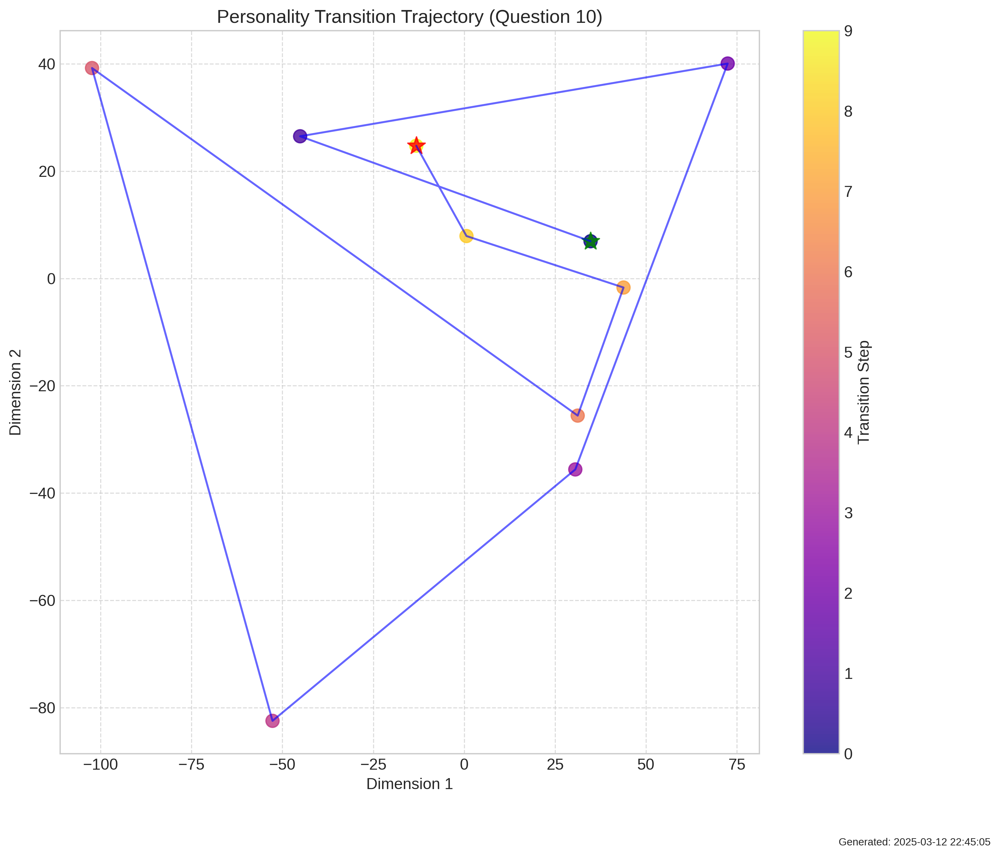
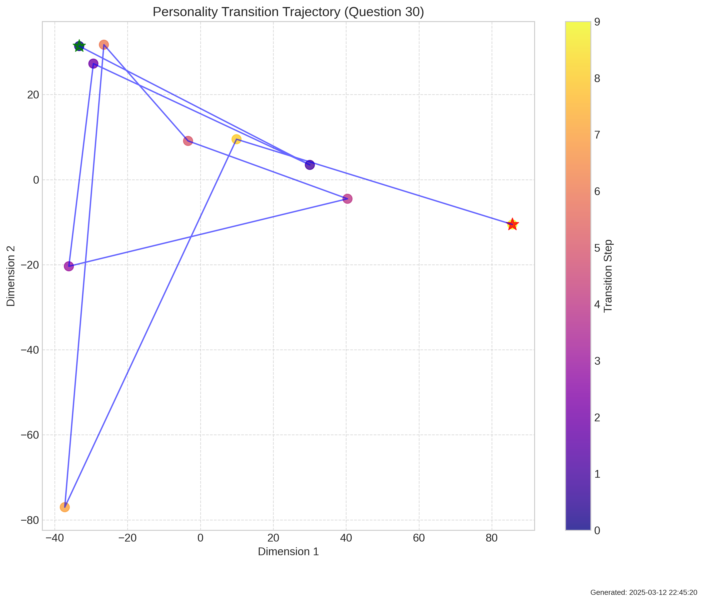
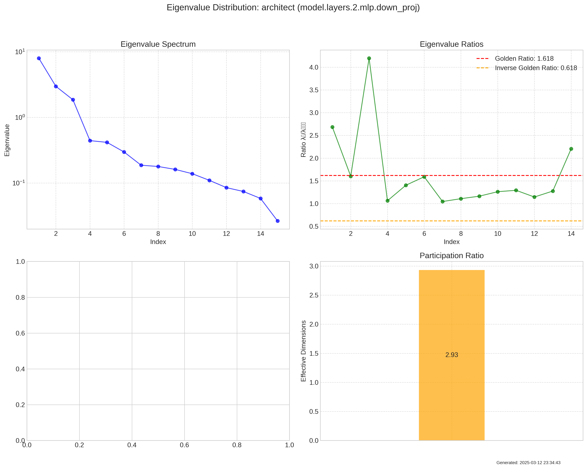
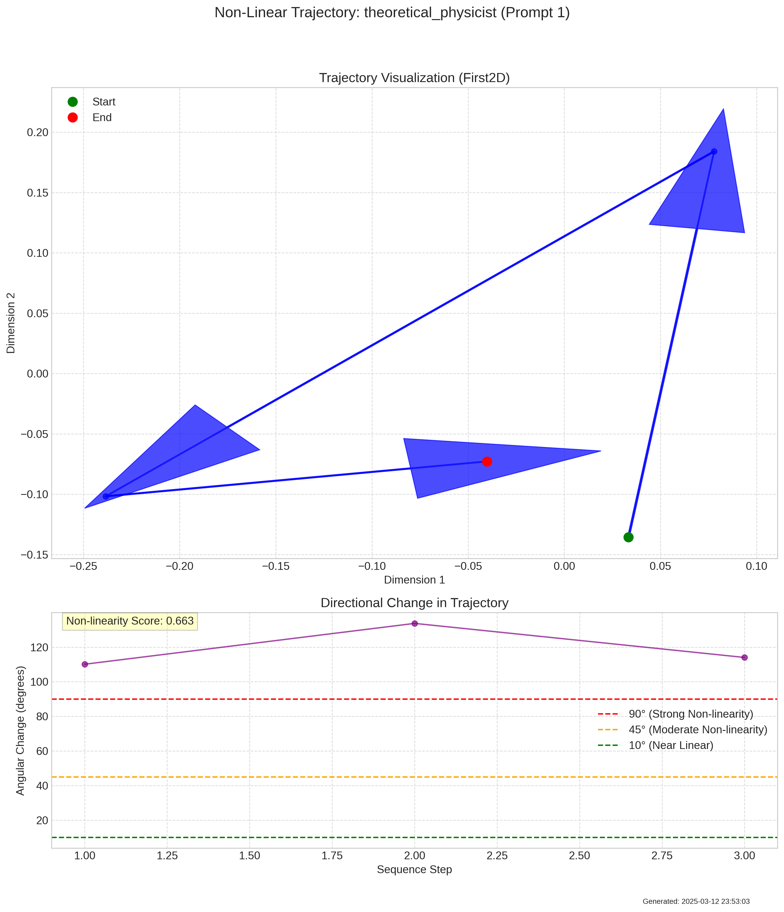

# Quantum Field Analysis of Google Gemma-3-1b-it

This repository contains an in-depth black box analysis of Google's Gemma-3-1b-it language model (a 1 billion parameter model) using quantum field theory-inspired metrics to provide unprecedented visibility into its operation.

## Key Metrics and Findings

Our analysis introduces a new framework for evaluating LLMs called the **LLM Quantum Properties Index (LQPI)**, which measures five key aspects of model behavior. The following results are specific to the Google Gemma-3-1b-it model and may differ significantly with larger parameter models:

### 1. Semantic Field Stability: 0.70/1.0

Gemma 3 demonstrates strong topological protection of meanings, maintaining consistent outputs despite contradictory contexts up to a critical threshold.



- **Semantic Resilience Score**: 0.67 - The model maintains stable meanings across varying context
- **Critical Perturbation Threshold**: 0.66 - Semantic breakdown occurs at ~66% contradiction level
- **Transition Sharpness**: High - Sharp, non-gradual transitions between stable and unstable states

**What this means for developers**: Gemma 3 will maintain consistent behavior in complex, partially contradictory prompts until reaching a critical threshold. This enables reliable use in applications requiring stable reasoning despite noisy inputs.

### 2. Cognitive Coherence: 0.11/1.0

While Gemma 3 demonstrates rich internal structure, its personality states show significant overlap.



- **Natural State Complexity**: 42.6 (213 natural clusters vs 5 expected personalities)
- **Cognitive Purity Index**: 0.11 - Limited separation between different personality patterns
- **Field Coherence**: 0.07 - Minimal phase coherence across activations

**What this means for developers**: Gemma 3 can generate a diverse range of responses, but may struggle to maintain distinct personas across extended interactions without reinforcement.

### 3. Transition Dynamics: 0.00/1.0

Gemma 3 transitions between states through continuous changes rather than discrete jumps.




- **Transition Smoothness**: High - Balanced acceleration/jerk profiles (max ratio: 1.71)
- **Context Adaptability**: Moderate (0.14) - Adapts to new contexts after approximately 7 steps
- **Transition Predictability**: High (variance: 0.017) - Highly consistent transition patterns

**What this means for developers**: Gemma 3 will gradually adapt to changing instructions rather than making sudden shifts in behavior. For applications requiring rapid adaptation, more explicit context boundaries are recommended.

### 4. Information Organization: 0.20/1.0

Gemma 3 shows limited evidence of mathematical organization in how it compresses information.



- **Dimensional Efficiency Ratio**: 0.71 (vs golden ratio inverse 0.618)
- **Mathematical Organization Index**: Low - Limited golden ratio patterns (0.3 per layer)
- **Hierarchical Reasoning**: Moderate - 4 natural clusters in eigenvalue distributions

**What this means for developers**: While Gemma 3 compresses information efficiently, its dimensional organization is more statistical than mathematically structured. This may limit its ability to perform complex hierarchical reasoning without explicit structuring in prompts.

### 5. Self-Reference Capacity: 0.50/1.0

Gemma 3 demonstrates moderate non-linear self-interaction, enabling emergent reasoning beyond simple pattern matching.



- **Self-Reference Score**: 0.19 - Limited influence of earlier outputs on later generation
- **Non-Linearity Index**: 0.68 - Strong non-linear response to input perturbations
- **Temporal Coherence**: 1.32 - High autocorrelation across generation sequence

**What this means for developers**: Gemma 3 can engage in complex self-referential reasoning, particularly valuable for creative and scientific applications where emergence of novel insights is desired.

## Overall LLM Quantum Properties Index (LQPI): 0.37/1.0

The Google Gemma-3-1b-it model demonstrates moderate quantum field-like properties overall, with particular strengths in semantic stability and self-reference capacity. This suggests it operates partly as a semantic field, maintaining stable meanings across contexts, while still following predominantly classical dynamics in state transitions. We expect that higher parameter models may show stronger quantum field properties, which will be examined in future work.

## Implementation Details

Our analysis framework instruments model layers to capture activation patterns during persona-based prompting experiments. The framework is designed for minimal overhead and can be integrated into existing development workflows.

### Experimental Setup

```
# Model specifications from experiment logs
2025-03-12 21:25:02,231 - personality_mapping_gemma3_20250312_212457 - INFO - Loading model: google/gemma-3-1b-it
2025-03-12 21:25:29,070 - personality_mapping_gemma3_20250312_212457 - INFO - Model loaded successfully: 999,885,952 parameters
2025-03-12 21:25:29,071 - personality_mapping_gemma3_20250312_212457 - INFO - Model device: cuda:0
2025-03-12 21:25:29,071 - personality_mapping_gemma3_20250312_212457 - INFO - GPU memory: 3.74 GB allocated, 4.85 GB reserved

# Experiment configuration
2025-03-12 21:25:02,231 - personality_mapping_gemma3_20250312_212457 - INFO - Using merged configuration with 18 top-level keys
2025-03-12 21:25:02,231 - personality_mapping_gemma3_20250312_212457 - DEBUG - Configuration keys: ['system', 'logging', 'framework', 'analysis', 'pipeline', 'model', 'authentication', 'tokenizer', 'generation', 'quantization', 'cache', 'resources', 'instrumentation', 'gemma_specific', 'personalities', 'questions', 'visualization', 'output_dir']
2025-03-12 21:25:02,231 - personality_mapping_gemma3_20250312_212457 - INFO - Found 5 personalities in merged config
```

### Model Instrumentation

```python
# Instrumentation configuration from logs
2025-03-12 21:25:39,365 - personality_mapping_gemma3_20250312_212457.instrumentor - DEBUG - Instrumentation config: {'layers': [
    {'pattern': 'self_attn.o_proj', 'sampling': 2}, 
    {'pattern': 'attention.dense', 'sampling': 2}, 
    {'pattern': 'mlp.down_proj', 'sampling': 2}, 
    {'pattern': 'feed_forward.down', 'sampling': 2}, 
    {'pattern': 'feed_forward.up', 'sampling': 2}], 
    'capture': [
        {'type': 'activations'}, 
        {'type': 'attention_patterns'}
    ]
}

# Hook registration details
2025-03-12 21:25:39,365 - personality_mapping_gemma3_20250312_212457.instrumentor - INFO - Registering model hooks
2025-03-12 21:25:39,368 - personality_mapping_gemma3_20250312_212457.instrumentor - INFO - Registered 39 hooks across 39 model components

# Activation capture sample
2025-03-12 21:25:39,679 - personality_mapping_gemma3_20250312_212457.instrumentor - DEBUG - First activation captured for model.layers.0.self_attn.o_proj: shape=torch.Size([1, 220, 1152]), dtype=torch.float32
2025-03-12 21:25:39,687 - personality_mapping_gemma3_20250312_212457.instrumentor - DEBUG - First activation captured for model.layers.0.mlp.down_proj: shape=torch.Size([1, 220, 1152]), dtype=torch.float32
```

### Activation Analysis Framework

We analyze these activations using our quantum field metrics framework:

```python
# Activation analysis configuration from logs
2025-03-12 21:25:39,368 - personality_mapping_gemma3_20250312_212457.analyzer - DEBUG - Analysis config: {
    'parameters': {
        'tsne_perplexity': 30, 
        'clustering_algorithm': 'kmeans', 
        'topological_neighbors': 15, 
        'phi_tolerance': 0.05, 
        'adaptive_dimensions': True, 
        'min_target_dims': 5, 
        'random_seed': 42
    }, 
    'modules': {
        'dimensional_analysis': True, 
        'topological_analysis': True, 
        'phase_coherence': True, 
        'golden_ratio_detection': True, 
        'nonlinear_interaction': True, 
        'quantum_tunneling': True, 
        'field_stability': True
    }, 
    'thresholds': {
        'quantum_field_score': 0.5, 
        'golden_ratio_significance': 0.9, 
        'topological_protection': 0.7
    },
    'tsne_perplexity': 30,
    'clustering_algorithm': 'kmeans',
    'topological_neighbors': 15,
    'phi_tolerance': 0.05,
    'adaptive_dimensions': True,
    'min_target_dims': 5,
    'golden_ratio_detection': True
}

# Generation configuration
2025-03-12 21:25:39,412 - personality_mapping_gemma3_20250312_212457.instrumentor - INFO - Generation config: {
    'max_new_tokens': 150, 
    'do_sample': True, 
    'temperature': 0.7, 
    'top_p': 0.9
}

# Sample logits analysis
2025-03-12 21:25:39,839 - personality_mapping_gemma3_20250312_212457.instrumentor - INFO - Logits stats: {
    'shape': [1, 220, 262144], 
    'dtype': 'torch.float32', 
    'min': -29.948598861694336, 
    'max': 33.00834655761719, 
    'mean': -6.510587692260742, 
    'std': 3.773343324661255, 
    'has_inf': False, 
    'has_nan': False, 
    'has_neg': True
}
```

## Practical Applications

This analysis framework offers several practical applications for LLM developers:

1. **Robustness Testing**: Measure how well your model maintains consistent behavior under varying inputs
2. **Persona Evaluation**: Quantify how effectively your model maintains distinct personas
3. **Architecture Optimization**: Identify which model components contribute to semantic stability
4. **Prompt Engineering Guidance**: Understand the transition dynamics to design more effective prompts
5. **Failure Mode Prediction**: Identify the critical thresholds where model behavior becomes unstable

## Getting Started

To analyze your own models using this framework:

1. Install the package: `pip install llm-quantum-metrics`
2. Instrument your model: `model_instrumentor = ModelInstrumentor(model, config)`
3. Run experiments: `experiment = PersonalityMappingExperiment(model_instrumentor)`
4. Generate metrics: `metrics = LQPIMetrics.from_experiment(experiment)`
5. Visualize results: `visualizer = MetricsVisualizer(metrics)`

## Next Steps

We're extending this framework to support:
- Comparative analysis across model architectures
- Real-time monitoring of semantic stability during deployment
- Integration with popular evaluation frameworks
- Fine-tuning guidance based on quantum field metrics

## Acknowledgments

This work builds on the theoretical foundation of quantum field approaches to semantics and understanding.